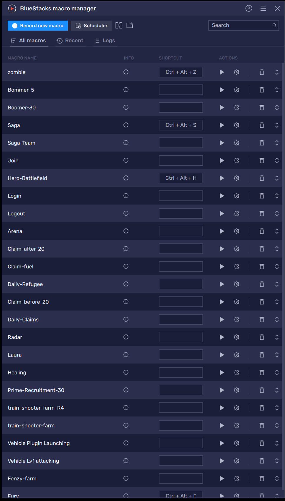
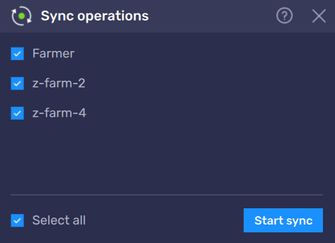
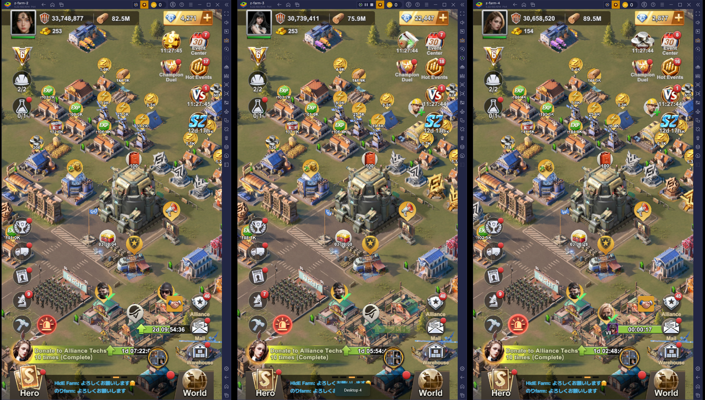

# BlueStacks Macro Guide for Last-Z pAq members

This guide demonstrates how to use BlueStacks macro features and sync operations for automating gameplay for farm account(s) and even your main Last-Z account.
> **Note:** This guide assumes you are already familiar with BlueStacks or you have been using BlueStacks to play Last-Z.

---

## Table of Contents

1. [Recording Macros](#recording-macros)
2. [Playing Macros](#playing-macros)
3. [Macro Scheduler](#macro-scheduler)
4. [Merging Macros](#merging-macros)
5. [Sync Operations](#sync-operations)
6. [Tips & Best Practices](#tips--best-practices)

---

## Recording Macros

If you have been playing Last-Z for a period of time, you would know that playing the game requires you to tap (on your phone) at the right position (coordinate) to execute an action within the game. BlueStacks macro feature is designed to do just that. 

### How to Record

1. Open BlueStacks macro manager by pressing ctrl + shift + 7 or click this icon. 

2. Press "Record new macro" 
3. Execute the action you intend to do.
4. Rename the macro to reflect the action.
5. (Optional) assign a shortcut to execute the macro.

### Recording Tips

- Last-Z developers tend to move the buttons from time to time although not very often. Therefore, when recording the macro for an action, make it as small as possible. It will become clear when you create a workflow combining multiple macros using scheduler or merge feature. 
- Once the recording is done, you can modify it to run multiple times. You can define how much time the macro manager has to wait before repeating the action.
- BlueStacks macros are saved to json files. You can import and export the files to backup or sharing with others. You can also modify the json file e.g., wait time to fit your needs. 

---

## Playing Macros

- You can press the play button or press the short cut keys to activate the action. 
- You can tell which action is being played by looking at the top bar. It will also show you how many times the action has been executed if you configure it to run multiple times. 

### Single Playback

1. The action is played just once e.g., activate war frenzy.
2. If you use it often, it's a good idea to create a short cut for the particular action.

### Loop Playback

1. The action is played repeatedly e.g., killing boomers, attacking the Fury Lord.
2. Once the recording is done, you can modify it to run multiple times. You can define how much time the macro manager has to wait before repeating the action.
3. You can stop the action midway by pressing the stop button at the top of the screen. You can also pause the action by pressing pause. 

---

## Macro Scheduler

The scheduler allows you to run macros automatically at specified times or intervals. This feature is very useful especially if you don't want to wake up during the night to complete a Full Preparedness action. You can also create a workflow using scheduler to execute a series of actions. For instance, I have created a workflow to flip 30 prime recruitment tickets for the hero initiative Full Preparedness tasks. The workflow follows these steps: Login -> prime-recruitment-30 -> logout

### Setting Up a Schedule

1. Press 'Scheduler' to open 'Macro scheduler' and press '+'  
2. Complete all the fields. I won't explain much here, the schedule GUI makes sense.
3. You can repeat the schedule task. In Last-Z, most likely you would want to repeat it weekly (every 7 days) at the same time.

## Merging Macros

You can merge multiple smaller macros into a workflow. This is similar to creating a workflow using scheduler. In my opinion, merging macros is a better way to create a workflow. You can try both ways; they have their pros and cons. 

Merging allows you to combine multiple macros into a single sequence.

### How to Merge

1. Next to the scheduler button, there is a small merge button on the right. Press it. 
2. Follow the GUI and provide the name of the workflow. 

---

## Sync Operations

If you have multiple farm accounts like me, this feature is very handy. Sync operations allow you to mirror actions across multiple BlueStacks instances simultaneously.

### Enabling Sync

1. Press ctrl + shift + 9 or click the sync button 

2. Select instances you want to sync. Note that you have to run all the instances that you want to sync.

> **Note:** If the layout inside your HQ is the same across multiple farm accounts, it will be easy to use sync operation. You can use "world" and "headquarters" buttons to reset the position. 

### Running Macros (or scheduler) with Sync

1. For some workflows, you can combine Sync operation with Macro. For instance, when my farm accounts Farms 2, 3, and 4 kill boomers, they always do it at the same time. Most of the time, they will target the same boomer so I can choose a level of boomer that is much stronger than my farms.
2. In some cases, you may want to combine scheduler with sync operation if you don't want to define the same schedule multiple times. Imagine that I have 4 farms and 1 main account. With sync operation, I can define the schedule once for all 5 accounts.
> **Note:** To run multiple accounts at the same time, your PC must be able to handle the workload of running those accounts e.g., CPU, main memory, GPU memory, etc.

*Last updated: March 2026*
