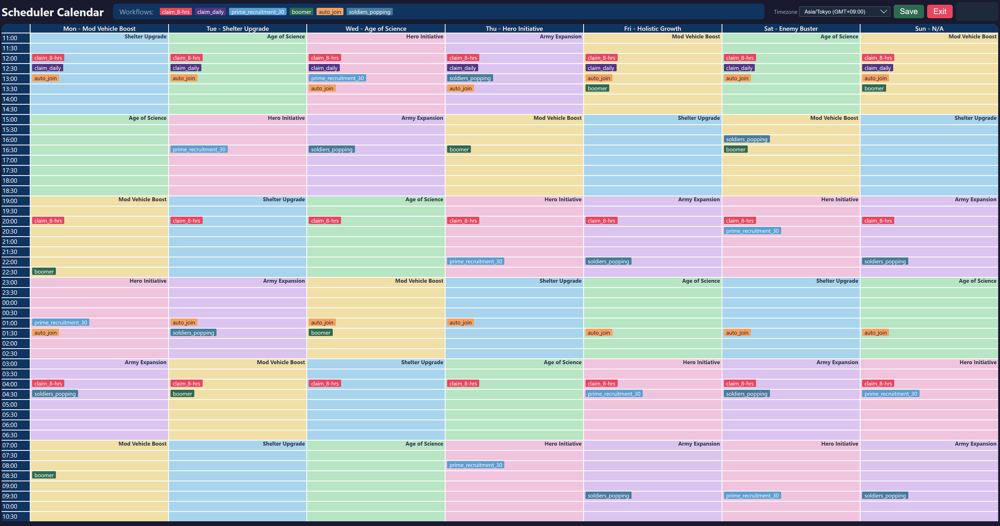

# Scheduler editor

The **Scheduler Calendar** is a local web UI for editing [`scheduler.json`](scheduler.json): when each automated **workflow** (batch file) should run across the week. The runner that executes those schedules lives in the parent repo (`scheduler.bat` → `scheduler_runner.py`).

The screenshot below was captured on **26 March 2026** and shows the interface as it looked that day.

## What you see

- **Weekly grid** — Seven columns (**Mon**–**Sun**) with the game’s **Versus** theme label per weekday (e.g. Mod Vehicle Boost, Shelter Upgrade). Rows are **30-minute** steps through the day (times in the left column).
- **Prep background** — Coloured blocks in the grid are **reference only**: they show the rotating **prep event** pattern for planning (Shelter, Science, Vehicle, Hero, Army, etc.). They are **not** edited directly and are **not** written to `scheduler.json`.
- **Workflows** — The top palette lists workflow types. Each maps to a `.bat` in the repo (e.g. `claim_daily` → `claim_daily_workflow.bat`). **Drag** a chip from the palette onto a cell to schedule it, **drag** an existing chip to move it, or hover a chip and use **×** to remove it.
- **Save** — Writes `scheduler.json`, then (via `scheduler_server.py`) attempts **git add/commit/push** for that file, **gitpull.bat** on remotes, and **`restart_scheduler.bat`** so remote schedulers pick up changes. The status pill shows success or if sync/restart failed.
- **Exit** — Stops the local HTTP server (same as pressing **Enter** in the server console).

## How to run the editor

From the repo, use the venv (Python 3) and start the server:

1. Open a terminal in `scheduler_editor/`.
2. Run **`scheduler_edit.bat`** (activates `..\.venv` and starts the server), **or** manually:
   - `..\.venv\Scripts\activate`
   - `python scheduler_server.py`
3. Open **http://127.0.0.1:8765/scheduler.html** in your browser (the batch file tries to open this for you).

Keep the terminal open while editing; close it or use **Exit** in the page when finished.

## Data format

`scheduler.json` holds a `workflows` array. Each entry has:

| Field | Meaning |
|--------|---------|
| `workflow` | Workflow id (matches palette / runner). |
| `bat` | Batch file name to run. |
| `day` | `0`–`6` (Mon–Sun), or **`null`** with a single `time` to mean **every day** at that time. |
| `time` | `HH:MM` (24 h), same convention as the grid. |

The editor may **collapse** seven identical “every day” rows into one `"day": null` entry on save.

## Related files

| File | Role |
|------|------|
| `scheduler.html` | Calendar UI (static). |
| `scheduler_server.py` | Local HTTP server on port **8765**: serves the UI and JSON, **POST /save_scheduler**, **GET /exit** to shut down. |
| `scheduler.json` | Schedule data (edit through the UI or by hand). |

For **running** the scheduled workflows (not editing), use **`scheduler.bat`** in the repository root.
